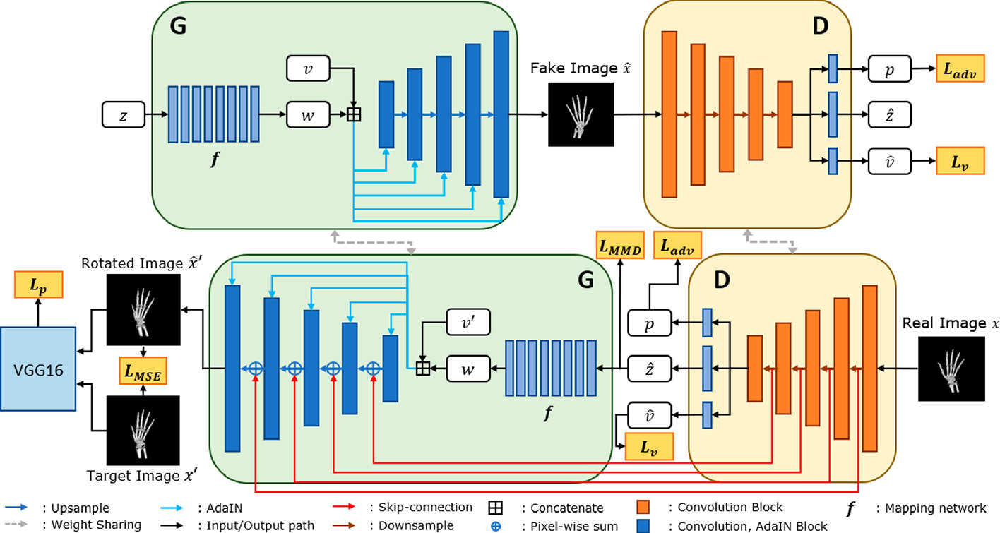
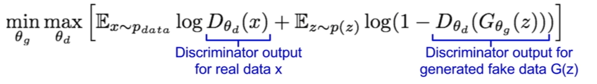

# MRI-Contrast-Generation-GAN

A capstone project by **Akash**, dedicated to leveraging CycleGAN (a type of Generative Adversarial Network) to generate brain MRI images of different contrast levels, enabling better medical diagnosis through enhanced imaging.

🔗 GitHub Repo: [https://github.com/akashmania068/MRI-Contrast-Generation-GAN.git](https://github.com/akashmania068/MRI-Contrast-Generation-GAN.git)

---

## Problem Statement

Misdiagnosis in the medical field is a serious issue, often stemming from the complexity of interpreting MRI scans. Radiologists may require multiple MRI contrast types (such as T1 and T2) to gain a comprehensive understanding, but acquiring these scans is both expensive and time-consuming.

This project aims to build a **Generative Adversarial Network (GAN)** model, based on a modified **U-Net** architecture, that can generate artificial MRI images of different contrast levels from a single scan. Using **CycleGAN**, this model translates the style of one MRI scan (e.g., T1-weighted) into another (e.g., T2-weighted), helping clinicians achieve more accurate diagnoses with fewer scans.

---

## Style GAN Architecture

---

## U-Net Architecture

---

## Basics of a GAN

### Components of a GAN

**1. Discriminator:**  
A classifier network that determines whether an input image is real (from the dataset) or fake (generated by the Generator).

**2. Generator:**  
A network that generates synthetic images from random input or transformed data, aiming to fool the Discriminator into thinking the images are real.

---

### Loss & Objective Function

**1. Discriminator Loss:**  
Measures how well the Discriminator distinguishes between real and generated (fake) images.

**2. Generator Loss:**  
Measures how well the Generator fools the Discriminator with synthetic images that look real.

**3. Objective Function:**  

- The **Discriminator** tries to **maximize** this objective (Gradient Ascent).
- The **Generator** tries to **minimize** this objective (Gradient Descent).
- The goal is to make the generated images indistinguishable from real ones.

---

## CycleGAN for MRI Style Transfer

CycleGAN is a variant of GANs that can learn to translate images from one domain to another without needing paired examples. In this project, it is used to perform **MRI style transfer**, converting **T1-weighted** scans to **T2-weighted** and vice versa.

---

## Author

**Akash**  
🔗 GitHub: [akashmania068](https://github.com/akashmania068)

---

